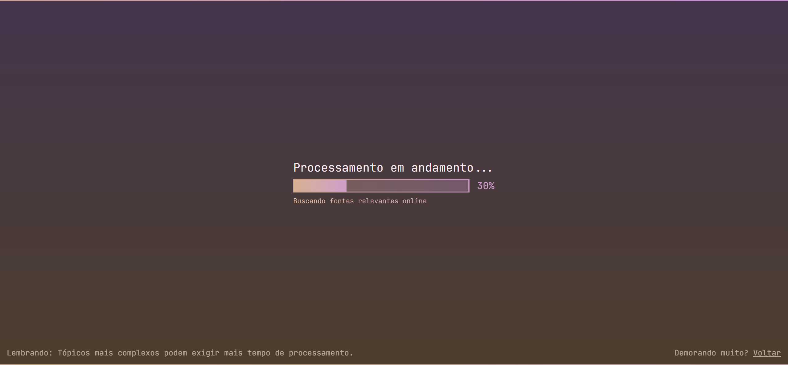
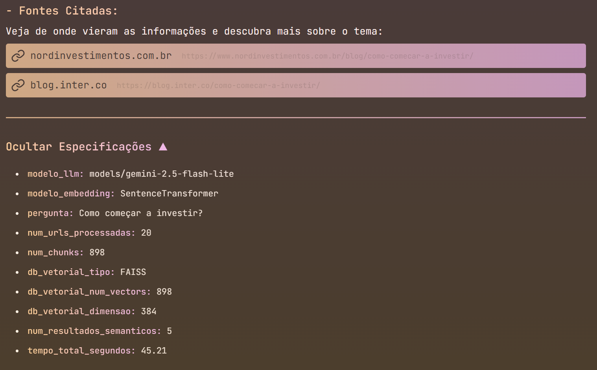

# sistema-de-pesquisa-web-inteligente

###### Projeto fullstack com pipeline avançado de RAG (Usando query enchantment, metaparser, chunking overlap, batch processing assíncrono, semantic search e reranking), web scraping (tavily), FAISS, embeddings, geração com LLMs e caching otimizado usando Redis, integrado a um backend FastAPI e frontend React com Server-Sent Events (SSE).

O usuário faz uma pergunta e o sistema pesquisa automaticamente na internet, acessando sites relevantes e extraindo as informações mais importantes. Enquanto isso acontece, o backend envia atualizações em tempo real para o frontend, que exibe uma tela de carregamento interativa. No final, o usuário recebe um resumo completo do que foi encontrado, junto com as fontes utilizadas e detaslhes técnicos.

<hr>

### Estrutura do projeto: 
#### FrontEnd: 
   

- **React** + **Vite** para criar a interface SPA *(Single Page Aplication)* e torná-la dinâmica. <br>
- **Talwind CSS** para estilizar o conteúdo.
-  **NodeJS** para rodar o servidor FrontEnd.

#### BackEnd:


<br>


<br>


- **Google Gemini** + **LangChain** para criar e orquestrar o fluxo inteligente.
- **FastAPI** + **Uvicorn** atuam como comunicação entre o FrontEnd e BackEnd.
- **Tavily** busca e extrai o conteúdo da internet (Web Scraping)
- **FAISS** + **Transformers** servem como mecanismo de vetor-store, armazenando e buscando embeddings executando RAG.
- **Redis** É usado como banco de dados para Caching.

<hr>

### Como utilizar?
Clone o repositório:
```
git clone https://github.com/Developer-Marcos/sistema-de-pesquisa-web-inteligente.git
```

<hr>

**Ativando o FrontEnd**:
 - Navegue até a pasta *frontend*:<br>
```
cd frontend
```

 - Instale as dependências do frontend:<br>
```
npm install
```

 - Inicie o servidor FrontEnd:
```
npm run dev
```
**Cole a URL (link) do local indicado no terminal para acessar o projeto.**

<hr>

**Ativando o BackEnd:**
 - Abra outro terminal e navegue até a pasta *backend*:<br>
```
cd backend
```

 - Instale as dependências do Python: <br>
```
pip install -r requirements.txt
```

- Crie o arquivo .env **dentro da pasta backend** e **adicione a sua API KEY** do Google Gemini e Tavily:<br>    
``` python
GOOGLE_API_KEY = "sua_API_KEY_google"
TAVILY_API_KEY = "sua_API_KEY_tavily"
```

 - Inicie o servidor da API:
```
uvicorn main:app --reload
```

<hr>

###### Opcional mas recomendado

**Ativando o banco de dados Redis:**
-  Baixe o Redis DB do site oficial.
-  Após baixar rode o banco de dados. 

<hr>

**Entre na pagina web e faça a sua pergunta.** <br>
###### O processo pode demorar pela primeira vez, mas por conta do caching, tende a ir ficando mais rapido conforme o uso.

<hr>

#### Fluxo de funcionamento:
<p>O Usuário faz uma pergunta ou escolhe uma das pré definições:</p>


<hr>

<p>O sistema vai processar todo o fluxo e receber as informações via SSE:<p/>
 


<p>No terminal do backend é possivel ver mais detalhes:</p>


<hr>

<p>No final a pesquisa é gerada no frontend:</p>


<p>Os detalhes também podem ser vistos:</p>



<hr>

###### Mais detalhes podem ser vistos dentro do código.
